# Water Reservoir Irrigation Controller (STM32 / Embedded Systems)

An embedded controller for an energy-efficient irrigation system with a central reservoir, **one pump**, and **three irrigation zones** at different elevations. The system fills the reservoir overnight from an inlet spring, then irrigates zones during the day using **different pump speeds (head/pressure requirements)** and a **servo-based distributor**.

---

## Project Highlights

- **End-to-end control loop:** scheduled operation → pipeline selection → sensing → actuation → telemetry
- **Deterministic scheduling:** exactly **one active pipeline** at a time (Inlet *or* one Zone)
- **Two operating modes:** **SETUP** (configure) → **RUN** (execute plan)
- **Real-time measurement:** interrupt-based RPM capture + periodic reservoir depth sensing
- **Built-in safety:** immediate shutdown + visible alerts when reservoir reaches **0%**

---

## Quickstart

### What you need
- STM32 Nucleo + your connected peripherals (motor driver, servo, ultrasonic sensor, RPM sensor, RGB LED, 7-seg/timer board, optional pot)
- A serial terminal (PuTTY, TeraTerm, minicom, etc.)
- Your build/flash workflow (e.g., STM32CubeIDE / Keil / etc.)

### Run the demo
1. **Flash** the firmware to the Nucleo.
2. Open a **UART serial terminal** (see firmware for the configured baud rate).
3. **Reset** the board → it enters **SETUP Mode**.
4. Follow the prompts to enter:
   - pipeline order (Inlet + three zones)
   - motor speed (preset PWM options; inlet may allow manual pot control)
   - start/stop wall-clock times (scaled time)
5. Press **B1** to start **RUN Mode**.

---

## PCB

### Design / Prototype
<p align="center">
  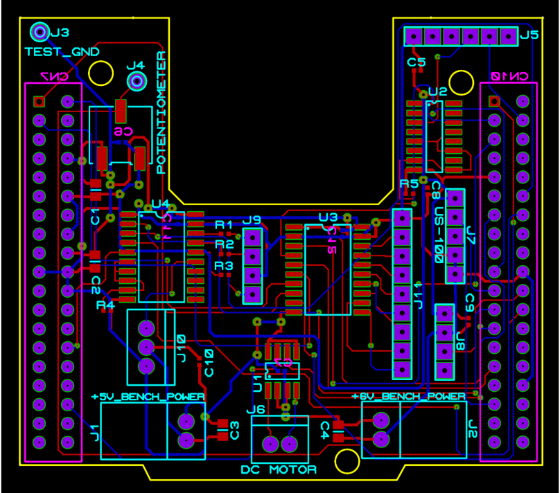
</p>

### 3D Assembly Views
<p align="center">
  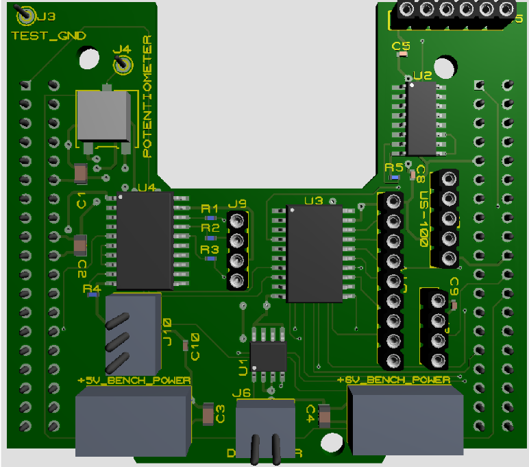
  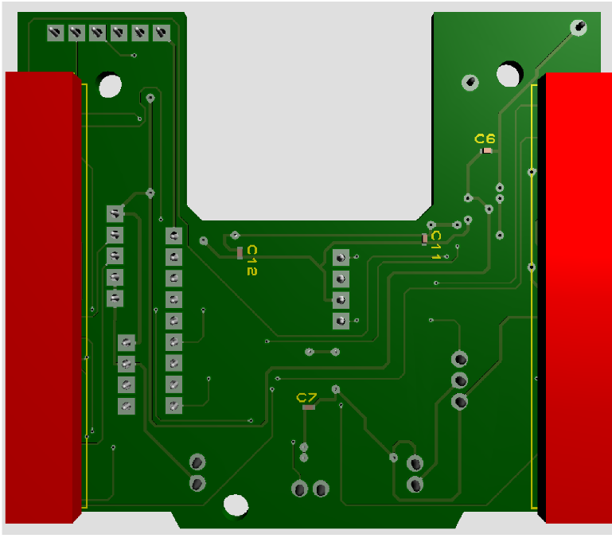
</p>

<details>
  <summary><b>Fabrication Layers (Top)</b></summary>
  <br/>
  <p align="center">
    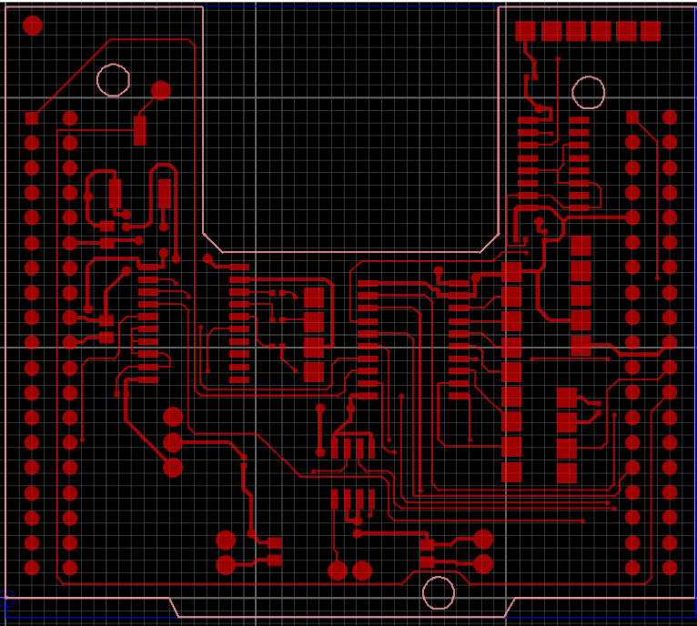
    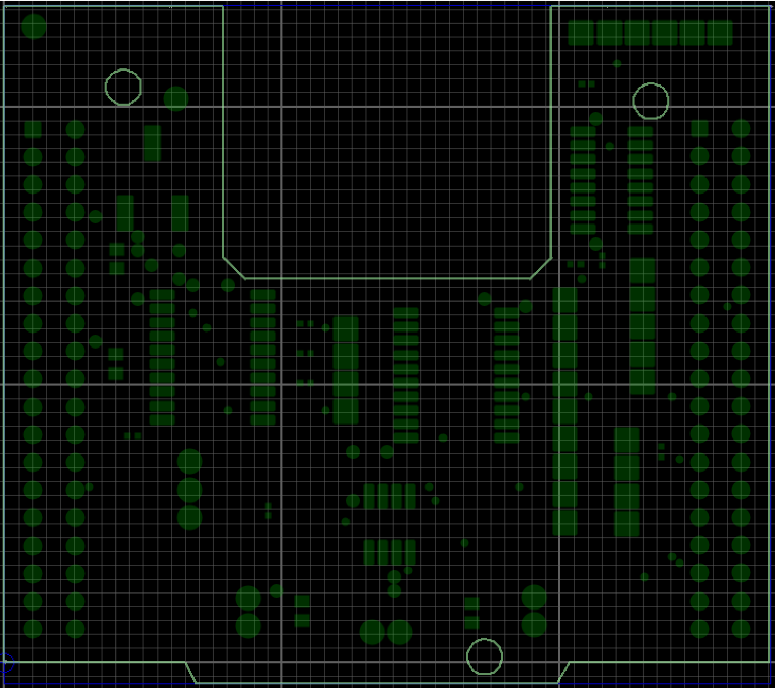
  </p>
  <p align="center">
    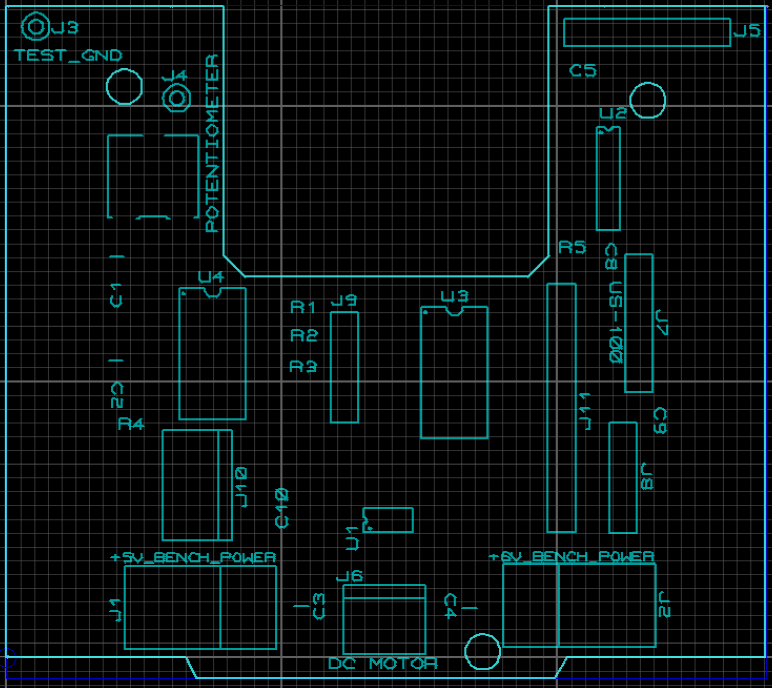
    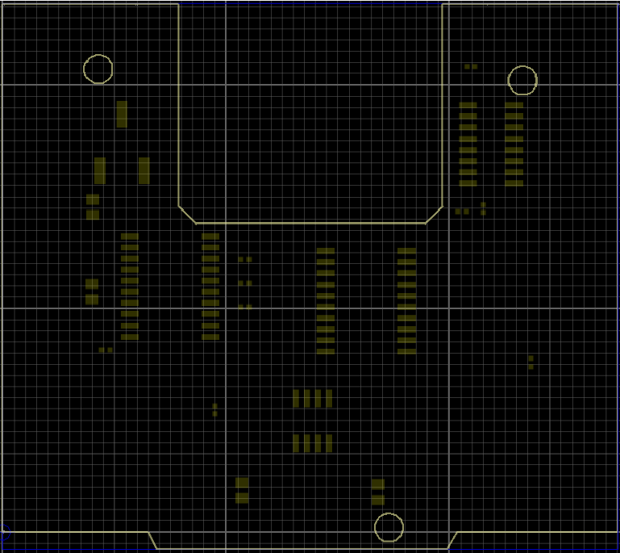
  </p>
</details>

<details>
  <summary><b>Fabrication Layers (Bottom)</b></summary>
  <br/>
  <p align="center">
    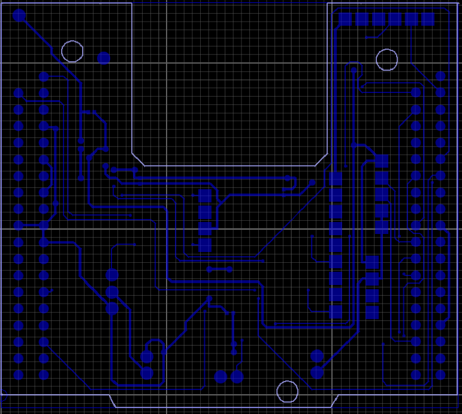
    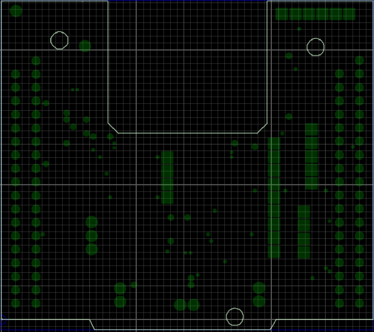
  </p>
  <p align="center">
    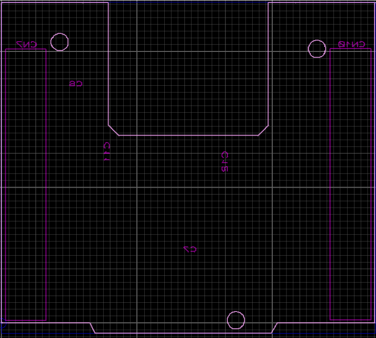
    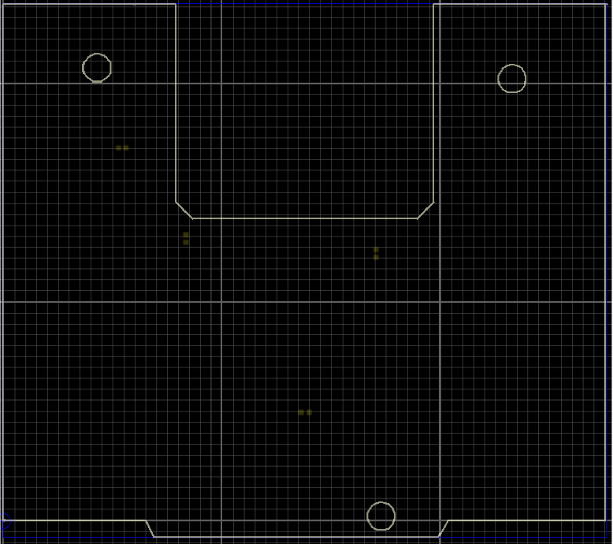
  </p>
</details>

---


## Features

- **Two-mode firmware (SETUP / RUN):** configure schedule + speeds, then execute automatically
- **Scaled-time clock:** demos a full 24-hour schedule in minutes
- **MCU peripherals:** UART, ADC, PWM (timers), GPIO, interrupts
- **Pump control:** DC motor PWM speed control with RPM feedback
- **Pipeline routing:** servo-based distributor selects Inlet / Zone 1 / Zone 2 / Zone 3
- **Live status outputs:**
  - UART telemetry log rows
  - timer board / 7-seg display shows reservoir depth %
- **Safety shutdown:** motor OFF + alerts when reservoir reaches 0%

---

## System Overview

### Physical flow
- Reservoir fills via **INLET** pipe connected to an underground spring (typically overnight).
- During the day, the controller irrigates **Zone 1 / Zone 2 / Zone 3** one at a time.
- Zones are at different elevations, so they require different head pressure → **different PWM/RPM setpoints**.

### Scheduling rule
At any moment, **only one pipeline connection** (Inlet or a single Zone) is active. No schedule overlap is allowed.

### Fill-first (demo intent)
The plan is configured so the system **fills via INLET first**, then proceeds through the zones in the selected order.

---

## Hardware

- **STM32 Nucleo** (main controller)
- **Ultrasonic distance sensor** (reservoir water level)
- **Brushed DC motor + motor controller** (pump drive via PWM)
- **RPM sensor** (interrupt-driven speed measurement)
- **Servo motor** (selects Inlet vs Zone outlet on distributor)
- **RGB LED** (shows selected pipeline; *example mapping:* Inlet = Purple)
- **Dual 7-segment display / timer board** (reservoir depth % 0–99)
- **Potentiometer** (optional manual speed input for inlet)
- **User inputs:** Nucleo **B1** pushbutton + mode LED (LD2)

---

## Wiring / Pinout (Example)

| Subsystem | Signal | MCU Peripheral | STM32 Pin | Nucleo Header | Notes |
|---|---|---|---|---|---|
| UART Terminal | TX | USART2_TX | PA2 | (VCP) | Serial logs + UI |
| UART Terminal | RX | USART2_RX | PA3 | (VCP) | Receives setup input |
| Motor Driver | PWM | TIM3_CH1 | PA6 | D12 | Pump speed control |
| Motor Driver | EN | GPIO Out | PB0 | D3 | Optional enable pin |
| Servo | PWM | TIM4_CH1 | PB6 | D10 | Distributor position |
| RPM Sensor | TICKS | EXTI0 | PA0 | A0 | Rising-edge interrupt |
| Ultrasonic | TRIG | GPIO Out | PB10 | D6 | 10µs trigger pulse |
| Ultrasonic | ECHO | TIM2_CH2 (IC) | PA1 | A1 | Pulse width → distance |
| Potentiometer | WIPER | ADC1_IN4 | PA4 | A2 | Manual inlet speed option |
| RGB LED | R | GPIO Out | PC7 | D9 | Pipeline indicator |
| RGB LED | G | GPIO Out | PC8 | D8 | Pipeline indicator |
| RGB LED | B | GPIO Out | PC9 | D7 | Pipeline indicator |
| 7-Seg (segments) | a,b,c,d,e,f,g | GPIO Out | PC0–PC6 | — | Segment lines |
| 7-Seg (digit select) | DIG1, DIG2 | GPIO Out | PB8, PB9 | — | Multiplex control |
| User Button | B1 | Built-in | PC13 | — | Start RUN mode |
| Mode LED | LD2 | Built-in | PA5 | — | Mode/status |

---

## Firmware Design

### Modes

#### 1) SETUP Mode (entered on reset)
- **Pump motor MUST be OFF** in SETUP.
- Terminal prompts for configuration:
  - pipeline order (Inlet + 3 zones)
  - motor speed per pipeline:
    - `0) Manual` (potentiometer, inlet only)
    - `1) 70% PWM`
    - `2) 85% PWM`
    - `3) 99% PWM`
  - wall-clock start/stop times (scaled time)

> Tip: keep your SETUP prompts + validation strict (reject invalid zone IDs / duplicates / overlapping times).

#### 2) RUN Mode
- Executes the configured 24-hour plan (in **scaled time**).
- For each scheduled pipeline window:
  - position servo to select pipeline
  - update RGB LED to pipeline color
  - command motor PWM (or pot-driven inlet speed if selected)
  - compute RPM from sensor ticks (**real-time RPM**, not scaled)
  - measure reservoir depth **at least once per hour**
  - print status via UART and update the timer board with depth %

---

## Scaled-Time Clock

To simulate a full day quickly:
- **24 wall-clock hours → 4.8 minutes real time**
- **1 wall-clock hour → 12 seconds real time**
- Time runs **~300× faster than real time**

---

## UART Telemetry

During RUN mode, logs print as consistent rows.

### Columns
`Wall-Clock Hour (minutes optional) | Zone/Inlet | Motor Speed %PWM | Motor RPM | Water Reservoir Depth %`

### Notes
- Depth must be monitored **at least once per hour**.
- You *can* print multiple rows per hour, but include **minutes** when you do.

### Example
```text
08:00 | ZONE_1 | 85% | 3120 RPM | 74%
